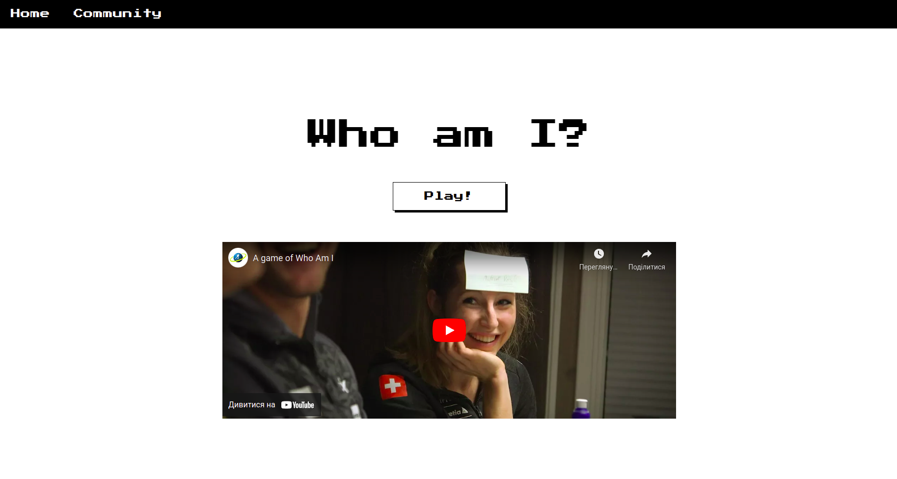
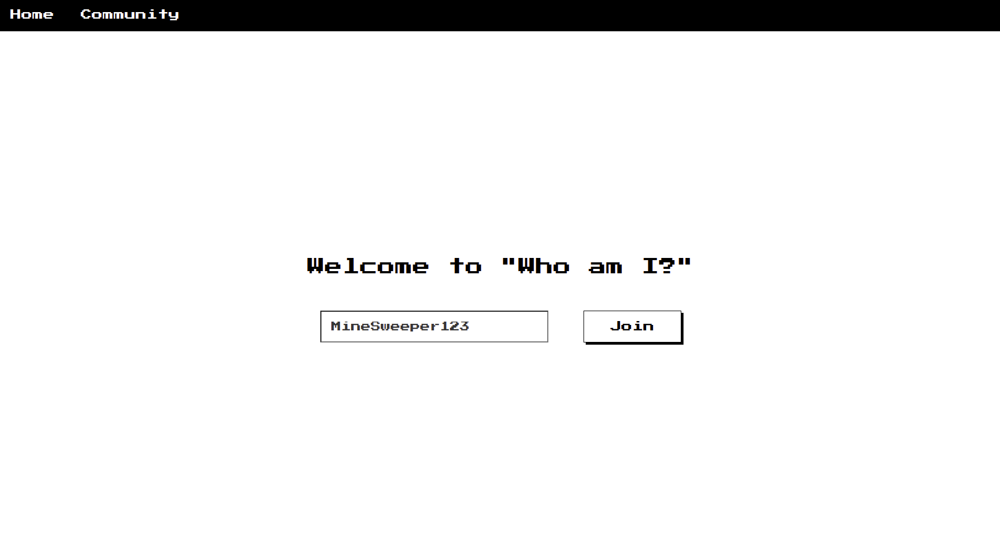
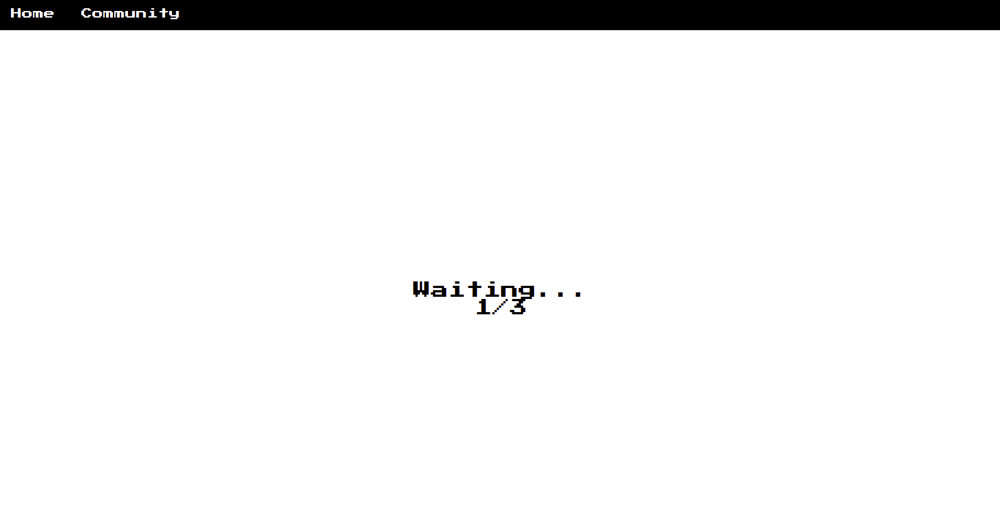
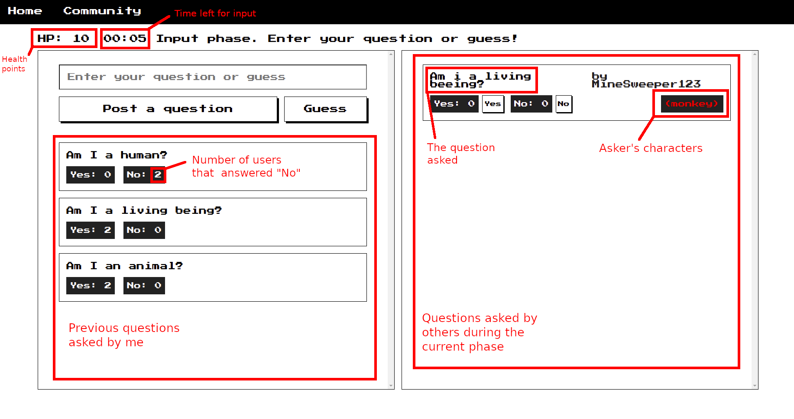
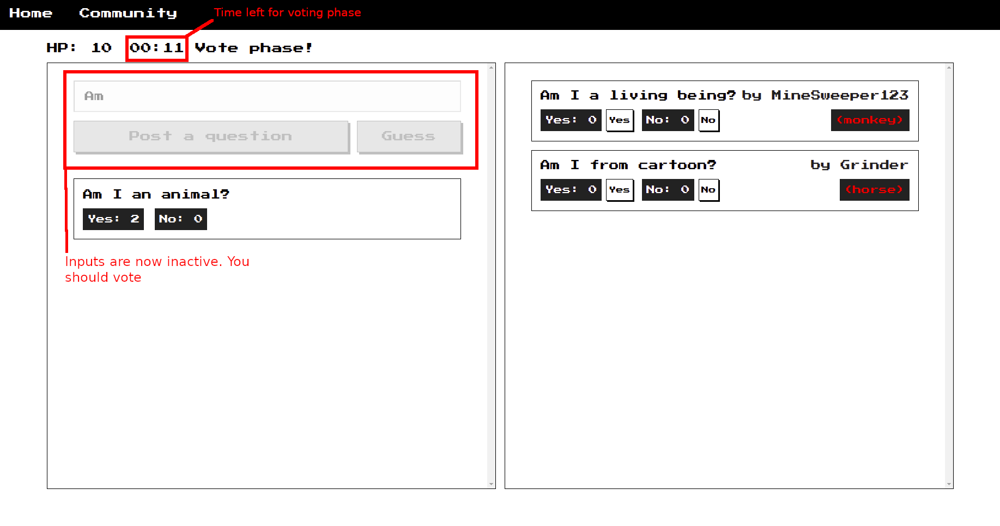
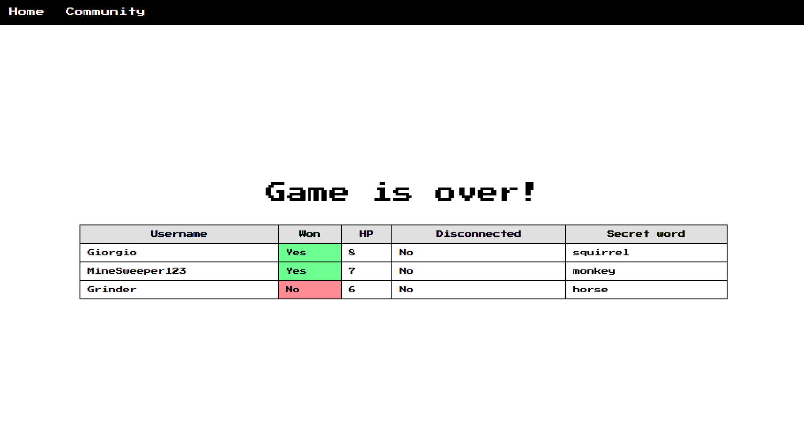

# Who am I?

"Who am I?" is an online multiplayer game where players use yes or no questions to guess the identity of a famous person or animal.

The project is currently <a href="https://who-am-i-ucu.herokuapp.com/">hosted</a> on Heroku.

## Local setup (Linux)
```bash
$ git clone git@github.com:viktorpovazhuk/basajs.git
```

Set up server:
```bash
$ cd basajs
$ npm install
$ npm start
```

Set up frontend:
```bash
$ cd basajs/frontend
$ npm install
$ npm start
```

## Website tutorial

1. Visit the website <a href="https://who-am-i-ucu.herokuapp.com/">main</a> page. 

2. Click "Play" button.
3. Enter your username (arbitrary). 

4. Click "Join".
5. Wait for others to join (they could be your friends). 

6. After other 3 players have joined, the game will start.
- the game is essentially a cycle and each iteration consists of 2 phases:
    - input phase: the user can either make a guess about his character or ask a question about his character
    
    - vote phase: the user answers the questions other users' questions.
    

7. After the game is over, the scoreboard is displayed: 
